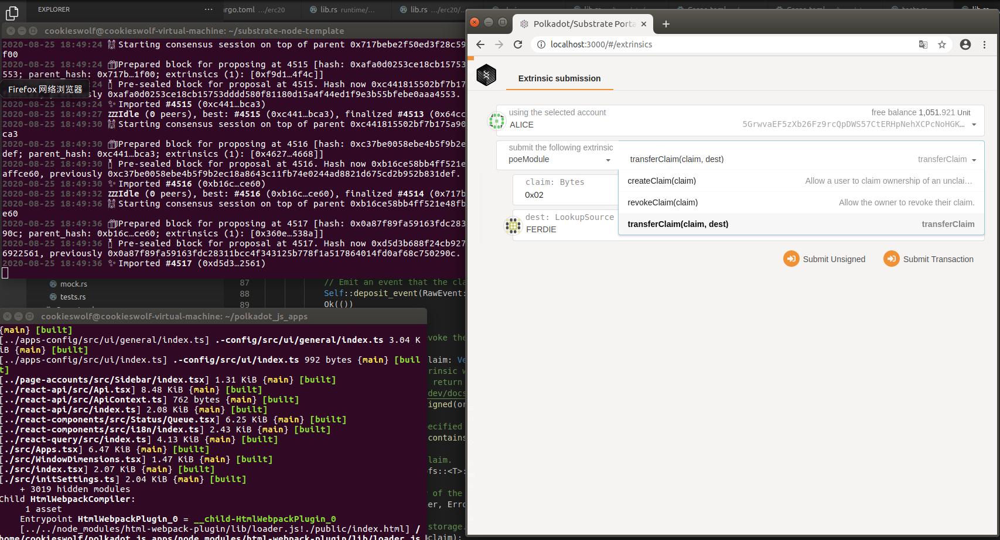

# 第一题

## 常用到的宏
decl_storage 定义存储单元
decl_module 包含可调用函数
decl_event 事件
decl_error 错误信息
construct_runtime 添加模块到 Runtime

## 常用的存储数据结构
### 单值
  #### 存储某种单一类型的值，如布尔，数值，枚举，结构体等
  #### 数值：u8,i8,u32,i32,u64,i64,u128,i128
  #### 大整数：U128,U256,U512
  #### 布尔：bool
  #### 集合：Vec<T>, BTreeMap, BTreeSet
  #### 定点小数：Percent,Permill,Perbill
  #### 定长哈希：H128,H256,H512
  #### 其它复杂类型：Option<T>,tuple,enum,struct
  #### 内置自定义类型：Moment,AccountId 
### 简单映射
   #### map类型，用来保存键值对，单值类型都可以用作key或者value
### 双键映射
   #### double_map类型，使用两个key来索引value，用于快速删除key1对应的任意记录，也可以遍历key1对应的所有记录
# 第二题
见substrate-node-template/pallets/poe/src/lib.rs中create_claim以及revoke_claim 
# 第三题
见substrate-node-template/pallets/poe/src/lib.rs中transfer_claim 

# 效果图
